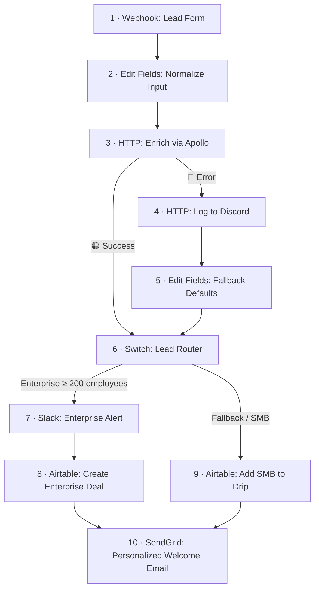

# 🎯 Lead Enrichment & Smart Router — n8n Workflow

An end-to-end **RevOps automation** built with **n8n**.

A lead submits a form → the workflow enriches the company via the **Apollo.io API** → a **Switch** node routes the lead by company size.

* 🏢 **Enterprise leads (≥ 200 employees)** → Slack alert + Enterprise CRM record in Airtable
* 🌱 **SMB leads** → SMB drip record in Airtable
* ✉️ **Every lead** → Personalized email via SendGrid

If the enrichment API fails, **no lead is lost**. The failure is logged to Discord, safe fallback values are applied, and the lead continues through the SMB path.

> **Errors are handled, never fatal.**

This portfolio project demonstrates:

* External API enrichment
* Credential management
* Conditional routing with Switch
* Error-output branching
* Retries with backoff
* Cross-node data references
* Multi-path convergence
* Graceful degradation

---

## 🔄 Architecture



### Flow Overview

The workflow has **two entry paths** into the Switch:

1. Normal enrichment data
2. Error-recovery data

The Switch creates two business paths:

* **Enterprise**
* **SMB / Fallback**

Both paths converge again into the final SendGrid email node.

**Every possible outcome ends with the lead processed and contacted.**

---

# 🧩 Node-by-Node

| #  | Node                                 | Type         | Job                                                                                |
| -- | ------------------------------------ | ------------ | ---------------------------------------------------------------------------------- |
| 1  | Webhook: Lead Form                   | Webhook      | Receives `name`, `email`, `company`, and `domain`                                  |
| 2  | Edit Fields: Normalize Input         | Edit Fields  | Cleans input, extracts first name, normalizes email, and derives domain if missing |
| 3  | HTTP: Enrich via Apollo              | HTTP Request | Calls Apollo Organizations Enrich API for employee count and industry              |
| 4  | HTTP: Log to Discord                 | HTTP Request | Sends enrichment failure alerts to Discord                                         |
| 5  | Edit Fields: Fallback Defaults       | Edit Fields  | Applies safe fallback values when enrichment fails                                 |
| 6  | Switch: Lead Router                  | Switch       | Routes by employee count                                                           |
| 7  | Slack: Enterprise Alert              | Slack        | Sends a hot-lead alert to the sales channel                                        |
| 8  | Airtable: Create Enterprise Deal     | Airtable     | Creates an Enterprise CRM record                                                   |
| 9  | Airtable: Add SMB to Drip            | Airtable     | Creates an SMB drip record                                                         |
| 10 | SendGrid: Personalized Welcome Email | SendGrid     | Sends a personalized email to every lead                                           |

---

# ✨ Design Decisions Worth Noting

## 1. Error-output branching — graceful degradation

The Apollo node uses n8n's:

**On Error → Continue (using error output)**

This gives the node two possible exits:

```text
🟢 Success → Switch

🔴 Error → Discord → Fallback Defaults → Switch
```

If Apollo fails, the workflow does **not** terminate.

Instead:

1. The failure is logged to Discord
2. Safe fallback values are applied
3. The lead continues through normal routing
4. The lead eventually receives the welcome email

This prevents an enrichment failure from becoming a lead-processing failure.

---

## 2. Retry with backoff for transient failures

The Apollo HTTP request is configured with:

* **2 retries**
* **3-second wait**
* **10-second timeout**

This gives the workflow a chance to recover from temporary network or provider failures before entering the error branch.

---

## 3. Safe-default routing

When enrichment fails, the workflow applies:

```text
employees = 0
industry = "unknown"
enrichmentStatus = "failed"
```

The lead therefore routes to the SMB/fallback path.

The principle is:

> **Fail down, not up.**

If company size is unknown, the workflow avoids incorrectly triggering the Enterprise sales process.

---

## 4. One expression, two data shapes

The Switch uses one expression that handles both successful Apollo responses and fallback data:

```javascript
{{ $json.organization?.estimated_num_employees ?? $json.estimated_num_employees ?? 0 }}
```

It supports both:

```text
Apollo response:
$json.organization.estimated_num_employees

Fallback data:
$json.estimated_num_employees
```

If neither value exists, it safely falls back to:

```text
0
```

This allows both paths to use the same routing rule.

---

## 5. Cross-node data references

Some n8n nodes return their own response data, which can replace the original lead fields in the current item.

Downstream nodes can therefore reference the original normalized lead directly:

```javascript
$('Edit Fields: Normalize Input').first().json.email
```

This keeps the original lead data available even after intermediate Slack or Airtable nodes have returned their own response data.

---

## 6. Least-privilege credentials

Credentials are scoped to the minimum permissions required by each service.

Examples:

* **Slack** → messaging permissions only
* **Airtable** → access limited to the required base
* **Apollo** → API access for enrichment
* **SendGrid** → dedicated API key

All secrets are stored in **n8n's encrypted credential store**.

The exported workflow contains **no credentials**.

The Discord webhook URL has also been replaced with a placeholder in this repository.

---

# 🚀 Setup

## Prerequisites

* n8n — self-hosted or cloud
* Apollo.io account
* Discord server/channel
* Slack workspace
* Airtable account
* SendGrid account

---

## 🔐 Credentials

Create the following credentials in n8n:

| Service       | Setup                                                                                                   |
| ------------- | ------------------------------------------------------------------------------------------------------- |
| **Apollo.io** | Create an API key and configure access for the enrichment endpoint                                      |
| **Discord**   | Create a channel webhook and add the URL to the Discord HTTP node                                       |
| **Slack**     | Create a Slack app, configure messaging permissions, install it to the workspace, and add the bot token |
| **Airtable**  | Create a Personal Access Token scoped to the required base                                              |
| **SendGrid**  | Create an API key and configure a verified sender                                                       |

### Apollo.io

Create an API key through Apollo's API/integration settings.

The workflow uses the Organizations Enrich endpoint.

The HTTP node sends the API key using:

```text
X-Api-Key: <YOUR_APOLLO_API_KEY>
```

### Discord

Create a webhook for the target Discord channel and paste the webhook URL into:

```text
HTTP: Log to Discord
```

### Slack

Create a Slack app and provide the required permissions for sending messages.

Install the app into your workspace and provide the bot token to n8n.

### Airtable

Create a base:

```text
n8n Lead Router
```

Create a table:

```text
Leads
```

Create a Personal Access Token with access limited to the required base.

### SendGrid

Configure a verified sender and create a SendGrid API key.

---

# 🗃️ Airtable Schema

Table: `Leads`

| Field     | Type                                           |
| --------- | ---------------------------------------------- |
| Name      | Single line text                               |
| Email     | Single line text                               |
| Company   | Single line text                               |
| Industry  | Single line text                               |
| Employees | Number (integer)                               |
| Tier      | Single select: `Enterprise` / `SMB`            |
| Status    | Single select: `Deal Created` / `Drip Started` |

---

# 📥 Import Workflow

1. Open n8n
2. Go to **Workflows → Import from File**
3. Import:

```text
Lead Enrichment & Smart Router.json
```

4. Re-create the required credentials
5. Open the Discord HTTP node
6. Replace the Discord webhook placeholder
7. Verify the Airtable base and table
8. Verify the Slack channel
9. Verify the SendGrid sender
10. Activate the workflow

The production webhook becomes:

```text
POST /webhook/lead-form
```

---

# 🧪 Testing

## Enterprise Path

Use a company with **≥ 200 employees**:

```powershell
Invoke-RestMethod `
  -Uri "http://localhost:5678/webhook-test/lead-form" `
  -Method Post `
  -ContentType "application/json" `
  -Body '{"name":"Ana Smith","email":"ana@shopify.com","company":"Shopify","domain":"shopify.com"}'
```

Expected flow:

```text
Webhook
   ↓
Normalize
   ↓
Apollo Enrichment
   ↓
Switch
   ↓
Enterprise
   ↓
Slack + Airtable
   ↓
SendGrid
```

---

## SMB Path

Use a company that enriches successfully but is below the Enterprise threshold:

```powershell
Invoke-RestMethod `
  -Uri "http://localhost:5678/webhook-test/lead-form" `
  -Method Post `
  -ContentType "application/json" `
  -Body '{"name":"John Doe","email":"john@techstartup.io","company":"Tech Startup","domain":"techstartup.io"}'
```

Expected flow:

```text
Webhook
   ↓
Normalize
   ↓
Apollo Enrichment
   ↓
Switch
   ↓
SMB
   ↓
Airtable
   ↓
SendGrid
```

---

## Error Path

Use an intentionally invalid domain so Apollo fails:

```powershell
Invoke-RestMethod `
  -Uri "http://localhost:5678/webhook-test/lead-form" `
  -Method Post `
  -ContentType "application/json" `
  -Body '{"name":"Walt Small","email":"walt@waltsmallcoxx.example","company":"Walt Small Co","domain":"waltsmallcoxx.example"}'
```

Expected flow:

```text
Webhook
   ↓
Normalize
   ↓
Apollo ❌
   ↓
Discord 🚨
   ↓
Fallback Defaults
   ↓
Switch
   ↓
SMB
   ↓
Airtable
   ↓
SendGrid
```

---

# 📊 Expected Results

| Test       | Slack | Discord | Airtable        | Tier       | Email |
| ---------- | ----: | ------: | --------------- | ---------- | ----: |
| Enterprise |     ✅ |       — | Enterprise Deal | Enterprise |     ✅ |
| SMB        |     — |       — | SMB Drip        | SMB        |     ✅ |
| Error      |     — |       ✅ | SMB Drip        | SMB        |     ✅ |

For successful enrichment, **Industry** and **Employees** come from Apollo.

For failed enrichment, the workflow uses the configured fallback values.

---

# ⚠️ Notes & Limitations

### Email Deliverability

Free SendGrid accounts may send emails without full domain authentication.

Test emails can therefore land in spam.

For production, configure proper domain authentication such as **SPF/DKIM**.

### Apollo Usage

Apollo enrichment availability depends on the account and plan.

The workflow retries failed enrichment requests according to the configured retry settings before using the fallback path.

### Enterprise Threshold

The current Enterprise threshold is:

```text
200 employees
```

This value is configured in the Switch node and can be changed according to business requirements.

### Production Improvements

A production implementation could additionally include:

* Webhook signature verification
* Form authentication
* Deduplication by email
* Provider-specific rate-limit handling
* More robust retry strategies
* HubSpot or Salesforce integration
* Persistent error logging
* Observability and monitoring
* Lead scoring
* Human approval before Enterprise CRM creation

---

# 🛠️ Built With

**n8n · Apollo.io · Slack · Airtable · SendGrid · Discord**

---

## 🎯 Portfolio Focus

This project demonstrates how an automation can be designed for both the **happy path** and failure scenarios.

The core architectural principle:

```text
External API Failure
        ↓
Handle the Error
        ↓
Preserve the Lead
        ↓
Apply Safe Defaults
        ↓
Continue Processing
        ↓
Contact the Lead
```

> **The automation degrades gracefully instead of simply stopping.**
